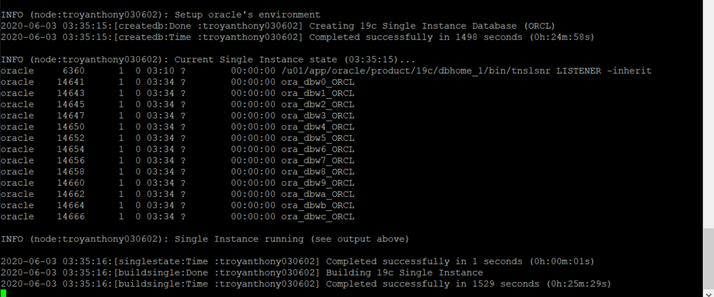
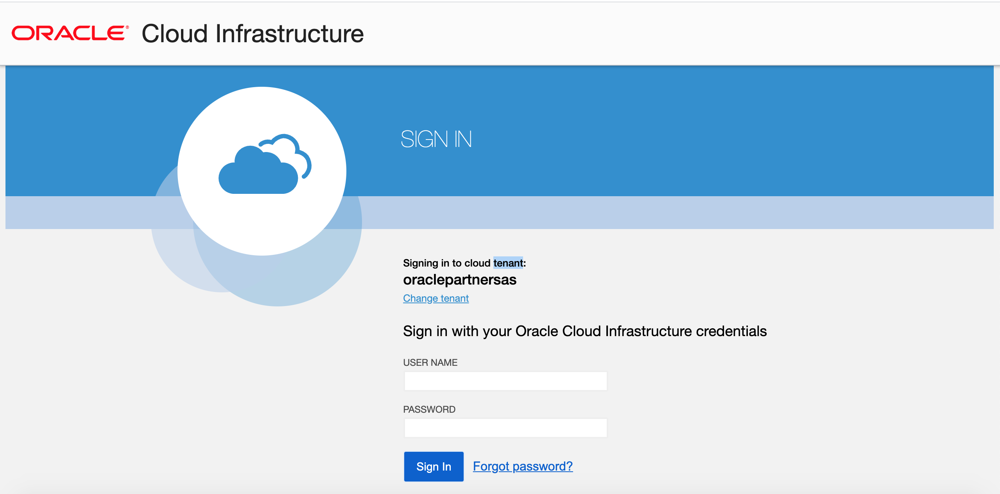

# Access Your ADG Workshop Environment

## Introduction
In this lab, you will learn how to access your ADG workshop environment. You will be assigned an environment to this workshop. It's include:

- A VM which already have installed a database 19c to simulate the on-premise database. You can connect to the VM instance with a ssh tools. The hostname and public ip address will be provide by the instructor.
- A Database Cloud Service which act as the standby database in the workshop. You will be assigned an OCI account to log into the Oracle Cloud console to access and manage your DBCS.

Estimated Lab Time: 20 minutes

### Prerequisites

This lab assumes you have:
- A Cloud account including: tenant name, username, password.

- The Region and Compartment where the DBCS created.

- A DBCS which assigned to you to act the standby database.

- A compute VM instance hostname and IP address which assigned to you to act as the on-premise database.

  

## **STEP 1**: Connect to your Compute instance

There are multiple ways to connect to your cloud instance.  Choose the way to connect to your cloud instance using the SSH Key you downloaded and unzipped. 

- MAC or Windows CYCGWIN Emulator

- Windows Using Putty
  
  
### MAC or Windows CYGWIN Emulator
1. Open up a terminal (MAC) or cygwin emulator as the opc user.  Enter yes when prompted.

    ````
    chmod 600 labkey
    ssh -i labkey opc@<Your Compute Instance Public IP Address>
    ````
    

    

4.  After successfully logging in, you can continue to do your lab.

### Windows using Putty

1.  Open up putty and enter the public ip address.

2.  Enter a name for the session and click **Save**.

    

3. Click **Connection** > **Data** in the left navigation pane and set the Auto-login username to **opc**.

4. Click **Connection** > **SSH** > **Auth** in the left navigation pane and configure the SSH private key to use by clicking Browse under Private key file for authentication.

5. Navigate to the location where you saved your SSH private key file, select the file like labkey.ppk, and click Open.  NOTE:  You cannot connect while on VPN or in the Oracle office on clear-corporate (choose clear-internet).

    

6. The file path for the SSH private key file now displays in the Private key file for authentication field.

7. Click Session in the left navigation pane, then click Save in the Load, save or delete a stored session STEP.

8. Click Open to begin your session with the instance.

## Step 2: Verify the Primary Database is Up

1. From your connected session of choice **tail** the `buildsingle.log`  file. This file has the configures log of the database.

   ````
   <copy>
   tail -f /u01/ocidb/buildsingle.log
   </copy>
   ````

   

2. When you see the following message, the database setup is complete - **Completed successfully in XXXX seconds** (this may take up to 30 minutes). You can do the step 6 while wait the database ready .

   

3. Run the following command to verify the database with the SID **ORCL** is up and running.

   ````
   <copy>
   ps -ef | grep ORCL
   </copy>
   ````

   

4. Verify the listener is running:

   ````
   <copy>
   ps -ef | grep tns
   </copy>
   ````

   

5. Connect to the Database using SQL*Plus as the **oracle** user.

   ````
   <copy>
   sudo su - oracle
   sqlplus system/Ora_DB4U@localhost:1521/orclpdb
   exit
   </copy>
   ````

   

6. To leave `sqlplus` you need to use the exit command. Copy and paste the text below into your terminal to exit sqlplus.

   ````
   <copy>
   exit
   </copy>
   ````

7. Copy and paste the below command to exit from oracle user and become an **opc** user.

   ````
   <copy>
   exit
   </copy>
   ````

You now have a fully functional Oracle Database 19c instance **ORCL** running on Oracle Cloud Compute, the default pdb name is **orclpdb**.

## **STEP 2**: Browse the DBCS on OCI

You can browse the Database Cloud Service that assigned to you.
1.  Connect to the Oracle Cloud Infrastructure Using the URL that instructor provided, like: `https://console.**-***-1.oraclecloud.com`. Enter the tenant name, username and password. 
  
    
    
2.  After signed into the OCI console, Open the navigation menu. Under **Database**, click **Bare Metal, VM, and Exadata**.

    

3. Make sure you are in the correct region and choose the right compartment, Click the link of the DB system which assigned to you.

    

4. In the **DB system Details** page, click the **Nodes** under the **Resources**, Write down the hostname, domain name and public ip address of the DB host.

    

5. Connect to the DB host with command line or putty as the Step 1.

6. Now you can move to the next lab.
